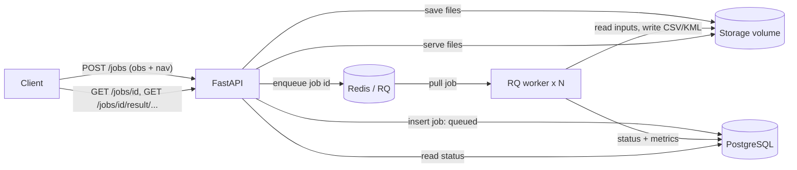

# GNSS Processing Service

[](https://github.com/sagigile/gnss-service/actions/workflows/ci.yml)

A backend service that turns a **RINEX** observation file into a position track (**CSV / KML**) plus quality
metrics. Upload files to a REST API, get a job id back immediately, and poll for the result while a worker
processes the job in the background.

The positioning algorithm (Weighted Least Squares over Galileo satellites, DOP-based satellite selection,
outlier filtering) is the solver from my coursework project
[NaviProject](https://github.com/sagigile/NaviProject), written with Taliya Levin. It is vendored
**unmodified** in `src/gnss_service/solver/legacy_main.py`. This repository is the service built around it:
API, queue, database, containers, tests and CI.

## Architecture



- **API (FastAPI):** validates and streams uploads to disk (size limit), creates the job, returns `201 queued`.
- **Queue (Redis + RQ):** decouples request handling from the CPU-bound solver; add workers to scale.
- **Database (PostgreSQL, SQLAlchemy, Alembic):** job state, timestamps, errors and metrics.
- **Worker:** runs the solver for one job, with a timeout. On start it marks jobs stuck in `running`
  (e.g. worker was killed) as failed.

## Run it

Requires Docker.

```bash
docker compose up --build        # API on http://localhost:8000 (set API_PORT to change)
```

```bash
curl -F obs=@tests/data/my_data_3.obs -F nav=@tests/data/samsung_nav.nav.rnx localhost:8000/jobs
curl localhost:8000/jobs/<id>
curl -o track.csv localhost:8000/jobs/<id>/result/clean.csv
```

The service needs **two** RINEX files: observations (`obs`) and a matching broadcast navigation file (`nav`).
Interactive docs: `http://localhost:8000/docs`.

| Endpoint | Description |
|---|---|
| `POST /jobs` | Upload `obs` + `nav`; returns the job (`queued`). `413` too large, `422` empty/missing, `503` queue down |
| `GET /jobs/{id}` | `queued / running / succeeded / failed`, timestamps, error, metrics |
| `GET /jobs/{id}/result/{clean.csv\|raw.csv\|clean.kml}` | Download result (`409` until the job succeeded) |
| `GET /health` | Liveness |

Metrics returned per job: epochs in file, epochs solved, points kept after filtering, mean PDOP, mean RMS
residual, mean number of satellites.

## Development

```bash
python -m venv .venv && .venv/bin/pip install -e ".[dev]"   # Windows: .venv\Scripts\...
pytest            # unit + API tests (SQLite, fakeredis)
ruff check .
INTEGRATION=1 DATABASE_URL=postgresql+psycopg://... REDIS_URL=redis://... pytest   # real services
```

23 tests: solver wrapper (including a regression check against the CSV produced by the original NaviProject
script), API behaviour, queue/timeout/failure handling, migrations, and two integration tests that run a
real forking RQ worker against PostgreSQL and Redis. CI (`.github/workflows/ci.yml`) runs lint, the full test
suite with Postgres and Redis service containers, and a smoke test of the Compose stack.

Performance numbers and how they were measured: [docs/benchmark.md](docs/benchmark.md).

## License and credits

MIT, see [LICENSE](LICENSE). Provenance of the vendored solver and sample data: [NOTICE](src/gnss_service/solver/NOTICE.md).

## Known limitations

- No authentication or rate limiting; no cleanup of old job files.
- Stuck-job recovery runs when a worker starts, not periodically. Failed jobs are not retried automatically.
- Solver is Galileo-only (as in the original) and expects a navigation file covering the observation time.
- RQ workers need `fork`: run them on Linux/macOS/Docker, not natively on Windows.
- The Compose database password is a development default (`POSTGRES_PASSWORD` overrides it).
